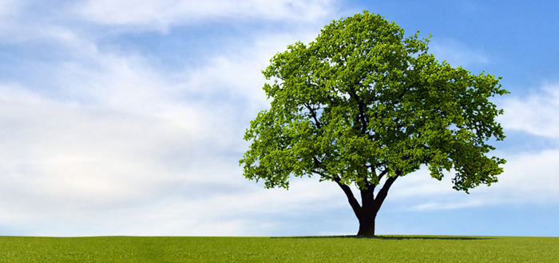
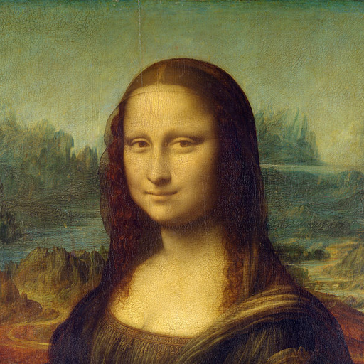
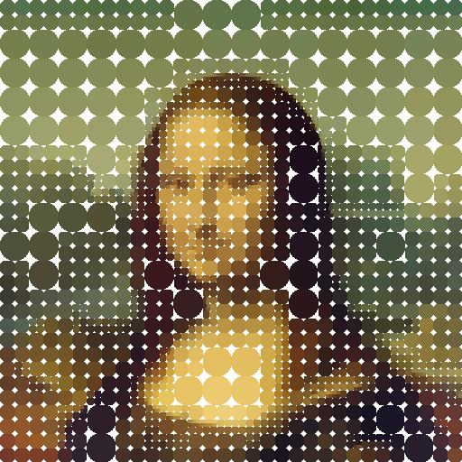

# voronoi

Computer art and animations created using [Voronoi diagrams](https://en.wikipedia.org/wiki/Voronoi_diagram) and [Quadtrees](https://en.wikipedia.org/wiki/Quadtree).

See [here](https://github.com/rileythomp/voronoi/blob/master/USAGE.md) for how to use.

Voronoi diagrams and quadtrees can be used together as a partitioning and colouring algorithm to give images a mosaic look.

| Original                        | Mosaic Image                       | Mosaic Gif              |                 
| ---                             | ---                                       | ---                            |     
|    |  |  |
|      |      |       |
|    |    |    | 
|  |  |   |

See [Examples.md](https://gitlab.com/rileythomp14/voronoi/-/blob/master/Examples.md) for more examples.

A Voronoi diagram is an image divided into a given number of regions, where each region is defined by a single point (a "site") and all the points that are closer to that site than any other. Here is an example of adding sites (shown by a black dot) 1 by 1 to an image and giving each region a random colour.

Here's 2 examples of 20 or so sites all moving in random directions. 

[Here](https://gitlab.com/rileythomp14/voronoi/-/blob/master/clips/addmove.mp4) are another [two](https://gitlab.com/rileythomp14/voronoi/-/blob/master/clips/voronoi.mp4) interesting examples.

In the examples above, distance to a site was determined using [Euclidean distance](https://en.wikipedia.org/wiki/Euclidean_distance), but other methods can be used, such as the [Manhattan distance](https://en.wikipedia.org/wiki/Taxicab_geometry) or the [Chebyshev distance](https://en.wikipedia.org/wiki/Chebyshev_distance).

| Euclidean                               | Manhattan                               | Chebyshev                               |                 
| ---                                     | ---                                     | ---                                     |    
|     |     |     | 
|       |       |       |
|    |  |  |
|  |  |  |
|      |    |    |
|    |    |    |

A quadtree is a tree data structure where each node has 4 children. It is used to represent the image by having each quadrant be the average colour of the image in that region. A metric similar to standard deviation for colour is used split the quadrant with the largest colour error. This has the effect of gradually increasing resolution. 

| Original                       | Quadtree Image                      | Quadtree Gif                         |                 
| ---                            | ---                                 | ---                                  |    
|        |      |        |
|      |    |      | 
|  |  |  |

This algorithm can also be used with other shapes like circles.

| Original                       | Circle Image                      |         
| ---                            | ---                                 | 
|        |      |
|        |      |

The quadtree data structure can also be used to create other fractal animations

| Fractal                       | H Tree                      | T Square                          |                 
| ---                            | ---                         | ---                              |    
|   |    |     |

See [QuadImage](https://gitlab.com/rileythomp14/QuadImage) for more info.

